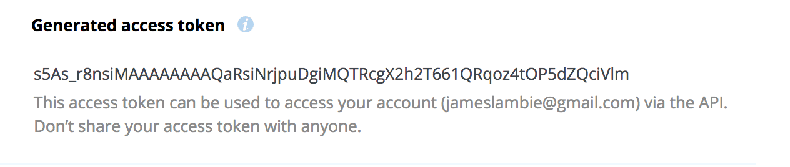

# DADI Web Dropbox Provider

Uses the Dropbox API method `"files/list_folder"`. See https://dropbox.github.io/dropbox-api-v2-explorer/.

## Requirements

* [DADI Web](http://github.com/dadi/web) (version 4.1.0 and above)

## Installation

Inside your Web application, install from NPM:

```console
$ npm install dadi-web-dropbox --save
```

## DADI Web Configuration

Add the name of this package to your DADI Web configuration to enable loading at application startup.

```json
"providers": [
  "dadi-web-dropbox"
]
```

## Dropbox Authentication

To give your Web application permission to access your Dropbox account, you'll need to setup a Dropbox
app wihich will provide you with an access token.

* Go to https://www.dropbox.com/developers/apps
* Click the `Create app` button


* Select "Dropbox API"


* Choose the access type. Selecting "App folder" will create a new folder in the "Apps" folder inside your Dropbox folder, with the name used in the next step.


* Give the new app a name


* In the settings for the new app, click the "Generate" button under the heading "Generated access token".


* A new token will be displayed - this is the token to add as an envirnment variable to allow `dadi-web-dropbox` to authenticate with your Dropbox account.


## Set environment variable

```console
$ DROPBOX_ACCESS_TOKEN=xyz node index.js
```

## Using the Dropbox provider in a Web datasource

* **source.type:** `"dadi-web-dropbox"`
* **source.path:** the path
* **fields:** an array of fields to add to the page context, for example ["name", "size"]. See the Datasource Results section below for examples.

```json
{
  "datasource": {
    "key": "dropbox",
    "name": "Blog posts from Dropbox",
    "source": {
      "type": "dadi-web-dropbox",
      "path": ""
    },
    "sort": {},
    "fields": []
  }
}
```

## Datasource Results

The response from Dropbox is added to the page's JSON context, using the key specified
in the datasource configuration.

```json
"dropbox": [
  {
    ".tag": "folder",
    "name": "test-folder",
    "path_lower": "/test-folder",
    "path_display": "/test-folder",
    "id": "id:ZnOjmcypYcAAAAAAAAAACA"
  },
  {
    ".tag": "file",
    "name": "testing.md",
    "path_lower": "/testing.md",
    "path_display": "/testing.md",
    "id": "id:ZnOjmcypYcAAAAAAAAAABg",
    "client_modified": "2017-10-08T11:43:20Z",
    "server_modified": "2017-10-08T11:43:20Z",
    "rev": "15d5935d2",
    "size": 3197,
    "content_hash": "7fb219dd99c3af92d38e6fd47f888b60c5e05836a061fa691aa4dbf337f6d61b"
  }
],
```